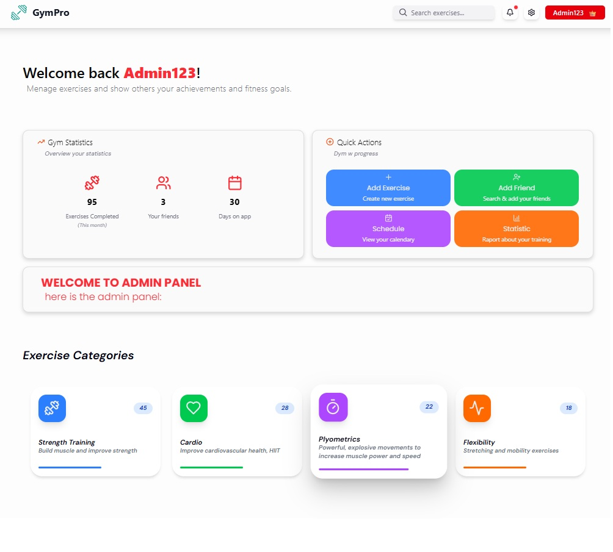
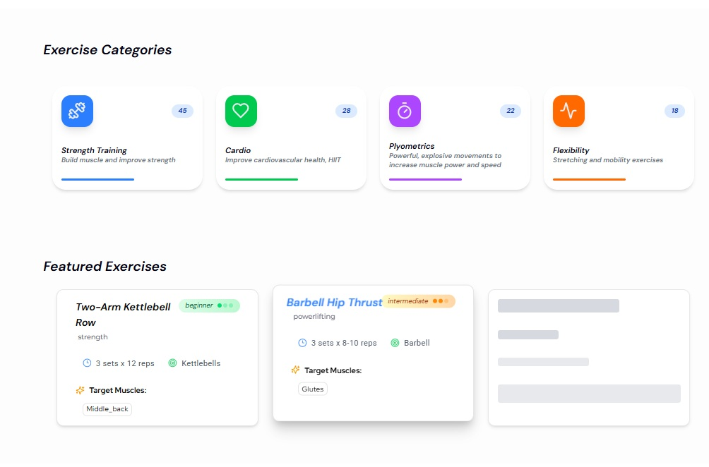
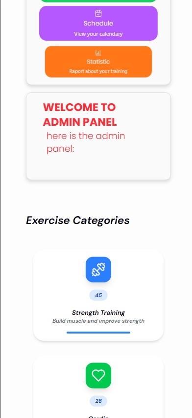
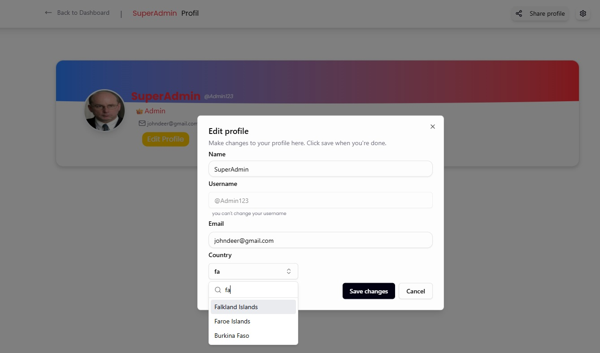

# 🏋️‍♂️ Gym Worker Exercise

### 🎯 Goal
Help gym workers and fitness enthusiasts plan, track, and manage their exercises efficiently!
And track progress of your friends too! 🪩🥳
---


### 🚀 MVP (Minimum Viable Product)
- Basic exercise logging and tracking 📒
- Adding Exercises and Track the schedule of it 📶
- User Profil with possiblity of editing it 🖊️
- Simple, user-friendly interface 😃
- User panel with statistics
- Responsive website app 🛜
---

### ✨ Features
- 📂 local Database profiles
- 📝 Checking the schedule of the user
- 💌 Sending Friends requests
- 📊 Track progress over time
- 🏃 Add multiple types of exercises
- ⏱️ Schedule workouts (if supported in app)

---

### State for: 17.08.2025: 💻
- Replaced the DummyUser into a database with 2 users(admin | user),
- Added simple loging page with already prepered options.
- Simple Local Database on LocalStorage.
- Got API error with Featured Exercises, so I am considering to (create OWN mini database with 10 exercises to get randomized).
- don't used motion.div, becouse... i am lazy ass,especially with this project.

# Features to "finish" the project:
    ✅ - Share Profile button -> copy link to github repository. 
    ✅ - Change User Profile Pictures (Admin, User)
    ✅- "Add a Friend" system, where you can send friend request to users.
    ✅- on /user menu with buttons showing (achievements, friends, Workouts Exercise History)
    ✅- Make for User schedule with days that you have already trained. (in /user 3rd tab)
    ✅ - Make Quick Actions, actually working
    
    - Make working Add Training Plan (localstorage the data - exercise,name, sets,reps,weight)
    - Create Footer with links to social media, and GitHub repository.
    - add "Admin" an Admin panel with options to add users, delete users, edit users, etc.
    - Make whole website full responsive

# - The plan to end this project is 2:30 am 18.08.2025

----------------------

# after finishing this project I will start new one that will be build full on shadcn components, and other supporting libraries, will have: login/signin, real database, and will be fully responsive. 
*https://tailark.com/, https://vite.dev/,  https://tailwindcss.com/docs/installation/using-vite, https://ui.shadcn.com/docs/components, https://motion.dev/*

----------------


=======
### 📸 Screenshots





---

### 🖥️ Technologies
- Vite
- TypeScript
- React
- Tailwindcss

---

### 🤝 Contributing
- PRs and suggestions welcome! 🎉
- Please open an issue for major changes.
- If you are interested into collaboration on any of
  smth of this kind, contact me. 🤝
---

------
## ❗ INFO  ❗
- This was my first bigger project with React that use more complicated pages and logics, so it is not perfect, before finishing it I already
see some things i could do better (start with building website based on database, not connecting it on last moment,
using shadcn components, not mixing it with my custom components, I changed the color schema of shadcn basic and use some colors like text-admin ☠️, etc.)
- I am not a professional, so I am still learning, and I am open to any kind and feedback🥰.
------


## 🧑‍💻 Installation

1. **Clone the repository**
  ```
  npm clone https://github.com/Marmo77/gym-worker-exercise.git
  cd gym-worker-exercise
  ```
2. Install required
  ```
  npm install
  ```
3. **Run the app!**
  ```
  npm run dev
  ```

---

Get ready to crush your goals! 💪🎉
